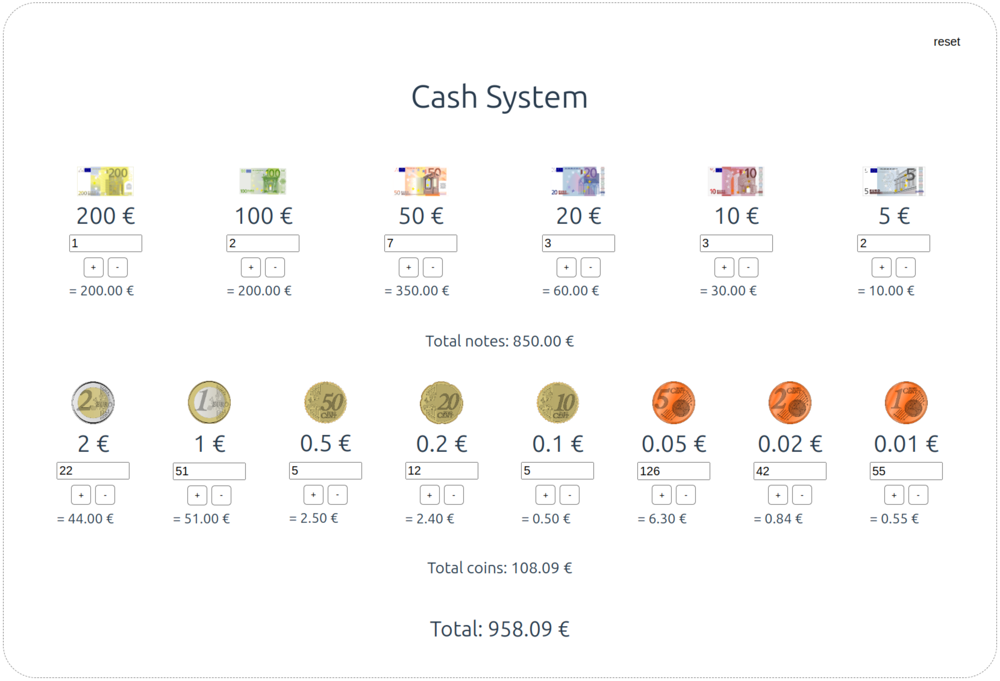

# cash-system

This project is a small simulation of a cash system to help calculate the contents of the cash register



## Technologies
- Vite
- Vue3
- Typescript

## Installation

First, clone this repository:

```sh
git clone https://github.com/soeguet/cash-system
```
Then, navigate into the project folder and install the dependencies:

```sh
cd cash-system
npm install
```
To build the project for production, run:

```sh
npm run build
npm run preview
```

This will create a dist folder with the built files and spin up a webserver.

## License

TeamChat is licensed under the [MIT License](https://opensource.org/license/mit/).